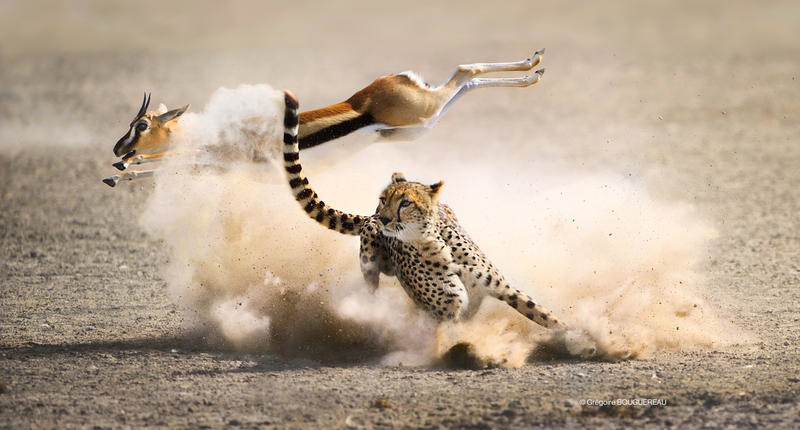
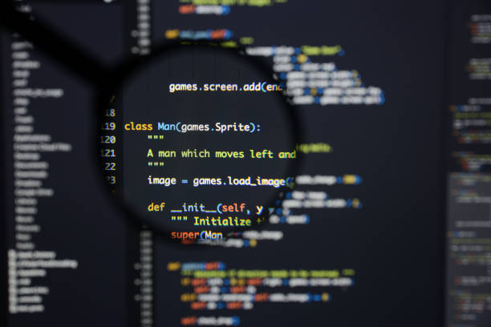

# Selection-Naturelle-ARE

# Sommaire
- [Membre du groupe de recherche](#membres)
- [Attribution des taches](#taches)
- [Présentation sommaire du sujet](#sujet)
- [Présentation du code](#code)
  - [Présentation du déplacement](#deplacement)   
  - [Présentation des interactions](#interaction)
  - [Présentation de la reproduction](#creation)
  - [Présentation du graphe obtenu](#graphe)
  

<a name="membres"/>

# Membre du groupe de recherche :
- Mark Lewis BWEMBA
- Adrien FORT
- Zakaria ZEROUALI 
- Guy NGOY

<a name="taches"/>

# Attribution des taches :
- Mark Lewis BWEMBA : Collision entre Balles (Reproduction et Disparition)
- Adrien FORT : Déplacement des Balles, Création du Graphe, Mise en Page
- Zakaria ZEROUALI : Déplacement des Balles, Site Internet
- Guy NGOY : Diapo et Documentation

<a name="sujet"/>

# Présentation du sujet :

  Pour notre projet ARE, nous avons décidé de nous pencher sur le sujet de la sélection naturelle. Pour cela nous allons simuler une chaine alimentaire dans laquelle des espèces seront dominantes ou dominées. Les espèces seront modelisées par des ronds de couleur et leurs tailles seront un indicateur de domination. Plus elles seront grosses, plus elles auront tendances à manger les autres (leur grande taille augmente aussi les chances de rencontrer d'autres espèces).
  

Cependant on observait simplement que l'espèce domiante était la seule qui restait en vie, on a donc décider d'introduire un genre. En effet, les boules femelles de l'espèces dominantes permettent aux mâles de se reproduire, néanmoins les femelles sont quant à elles des proies potentielles des autres espèces et les bébés aussi sont vulnérables à toutes les autres espèces étant données qu'ils ne sont pas asssez developpés. De cette manière on peut voir en fonction du nombre d'individu, l'évolution de l'espèce dominante qui, malgré sa domination flagrante, peut être voué à l'extinction. En jouant sur les paramètres de notre projet, on peut observer diverses phénomènes qui étaient plutôt impredictible.

 

<a name="code"/>

# Présentation du Code :

<a name="deplacement"/>

## Déplacement

Pour ce qui est de la partie technique, nous nous sommes servi du logiciel python ainsi que du module tkinter pour modéliser notre projet. Il a fallut d'abord créer des balles et leur affecter un déplacement, pour ce faire on s'est servi d'une boucle dans laquelle on change les coordonnées à chaque tour. Il a aussi fallut créer un rebond pour que la balle ne quitte pas le cadre.

<a name="interaction"/>

## Interaction:

Une fois les balles en mouvement, nous avons instauré une dominance qui se traduisait par une forte probabilité qu'une balle en "mange" une autre lors d'une rencontre.

<a name="creation"/>

## Création
Après la suppresion vient la création, lorsque les balles mâles et femelles d'une même espèce se rencontre, on instaure une probabilité qu'il se reproduise que l'on peut modifier (cette probabilité peut correspondre à une saison ou un environnement plus ou moins favorable à la reproduction.

<a name="graphe"/>

## Graphe

Pour finalement obtenir un graphe d'évolution, il fallait que la boucle puisse se terminer, on a donc instaurer un stop qui prend effet dès lors que les bébés de l'espèce rouge et blanche ne sont plus sous la menace des prédateurs environnant et sont donc voués à devenir adultes.

